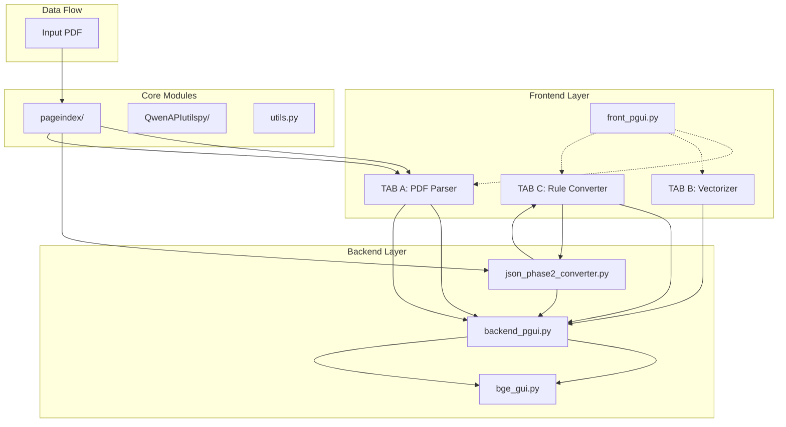

# RAG系统架构文档

## 系统概述

RAG Code Buddy DEV0 是一个多层次的文档智能处理系统，专门设计用于处理复杂文档（如航空公司的波音飞机手册）的解析、向量化和检索。系统采用模块化设计，支持多种处理管道和模型后端。

## 整体架构

### 高层架构

```
┌─────────────────────────────────────────────────────────────────┐
│                    RAG Code Buddy DEV0                          │
├─────────────────────────────────────────────────────────────────┤
│  ┌─────────────┐  ┌─────────────┐  ┌─────────────┐            │
│  │   FRONTEND  │  │  BACKEND    │  │   UTILS     │            │
│  │   GUI       │  │   PROCESS   │  │   MODULES   │            │
│  │             │  │             │  │             │            │
│  │ • TAB A     │  │ • TAB B     │  │ • PageIndex │            │
│  │ • TAB C     │  │ • BGE Client│  │ • Vector    │            │
│  │ • Progress  │  │ • API Utils │  │ • Config    │            │
│  │ • Visualizer│  │             │  │             │            │
│  └─────────────┘  └─────────────┘  └─────────────┘            │
└─────────────────────────────────────────────────────────────────┘
```

### 组件关系图



## 模块详解

### 1. Frontend GUI (front_pgui.py)

#### 功能
- 三标签页界面管理
- 用户交互处理
- 进度监控
- 日志输出

#### 核心组件
- **TAB A**: PDF解析与PageIndex构建
- **TAB B**: LLM驱动的向量化处理
- **TAB C**: 规则基础的快速转换

#### 架构特点
- 多线程处理
- 进度可视化
- 异常处理机制

### 2. Backend Processor (backend_pgui.py)

#### 功能
- LLM驱动的语义分析
- 向量化文本生成
- 元数据提取与优化

#### 处理流程
1. 读取PageIndex JSON
2. 递归遍历树结构
3. 调用LLM生成语义导语
4. 生成RAG-ready JSON

#### 关键算法
- 递归树遍历算法
- LLM提示工程
- 结构化数据生成

### 3. BGE Client (bge_gui.py)

#### 功能
- 向量化处理界面
- 重排序功能
- SQLite数据库管理

#### 核心特性
- 批处理支持
- 错误恢复机制
- 进度跟踪

### 4. Rule Converter (json_phase2_converter.py)

#### 功能
- 树状结构到扁平结构转换
- 无LLM依赖的高速处理
- 与TAB B输出格式兼容

#### 算法逻辑
1. 递归遍历树结构
2. 提取章节路径信息
3. 生成语义导语
4. 生成元数据

## 数据流架构

### 处理管道

```
PDF Document
      │
      ▼
PageIndex JSON (Tree Structure)
      │
      ├─► TAB A Pipeline: Direct Processing
      │
      ├─► TAB B Pipeline: LLM Enhancement
      │   │
      │   ▼
      │   RAG-ready JSON (Enhanced)
      │
      └─► TAB C Pipeline: Rule-based Conversion
          │
          ▼
          RAG-ready JSON (Rule-based)
              │
              ▼
          Vector Database (SQLite)
              │
              ▼
          RAG Query Engine
```

### 数据结构转换

#### 输入格式 (PageIndex JSON)
```json
{
  "doc_name": "document.pdf",
  "structure": [
    {
      "title": "Chapter 1",
      "text": "content...",
      "nodes": [
        {
          "title": "Section 1.1",
          "text": "content...",
          "nodes": []
        }
      ]
    }
  ]
}
```

#### 输出格式 (RAG-ready JSON)
```json
{
  "embedding_text": "semantic introduction + original content",
  "section_hint": "section type",
  "metadata": {
    "doc_title": "document title",
    "section_id": "unique id",
    "section_path": ["path", "to", "section"],
    "depth": 1,
    "original_length": 100,
    "strategy": 0
  },
  "original_snippet": "original content"
}
```

## 技术架构

### 设计模式
- **生产者-消费者**: GUI线程与后台处理
- **观察者模式**: 进度更新与UI响应
- **工厂模式**: 不同处理管道的创建

### 并发模型
- PyQt多线程
- 批处理机制
- 异步API调用

### 错误处理
- 优雅降级
- 重试机制
- 详细日志记录

## 部署架构

### 本地部署
- 单机架构
- SQLite数据库
- 本地模型可选

### 扩展选项
- 微服务架构支持
- 分布式处理
- 云原生部署

## 性能优化

### 缓存策略
- 结果缓存
- 向量缓存
- 查询缓存

### 批处理
- 向量化批处理
- API调用批处理
- 数据库操作批处理

### 并发控制
- 线程池管理
- 资源限流
- 任务调度

## 安全架构

### 数据安全
- 本地处理选项
- API密钥管理
- 数据隔离

### 访问控制
- 配置文件权限
- API访问限制
- 审计日志

## 扩展性设计

### 插件架构
- 模型插件化
- 处理器插件化
- 存储插件化

### API抽象
- 统一API接口
- 多供应商支持
- 配置驱动

---

**文档版本**: 1.0  
**更新日期**: 2026-01-18  
**作者**: RAG Code Buddy Architecture Team