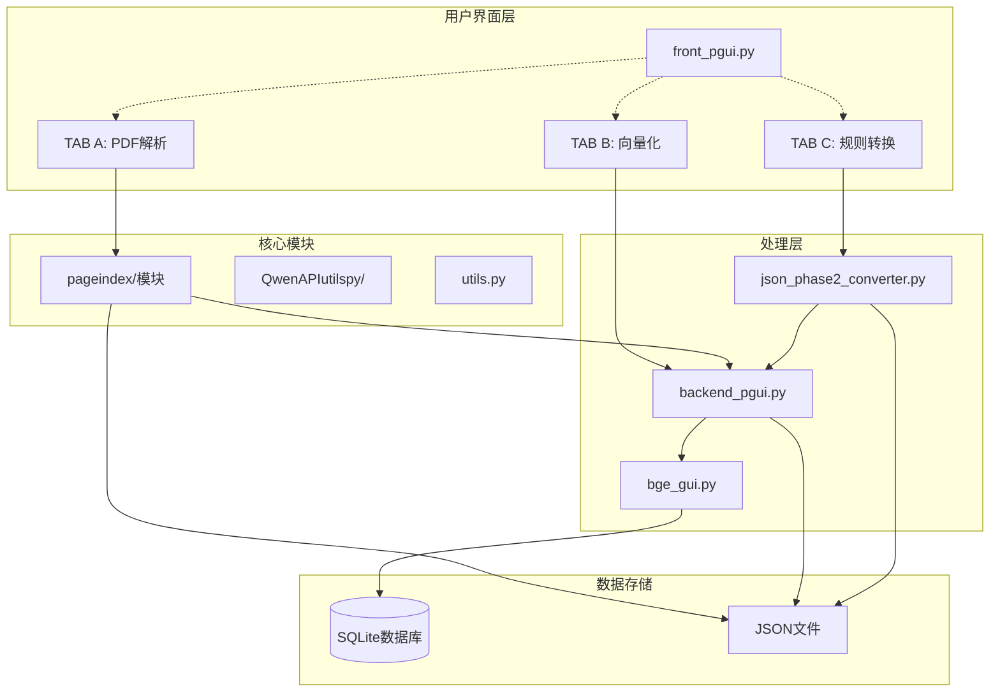
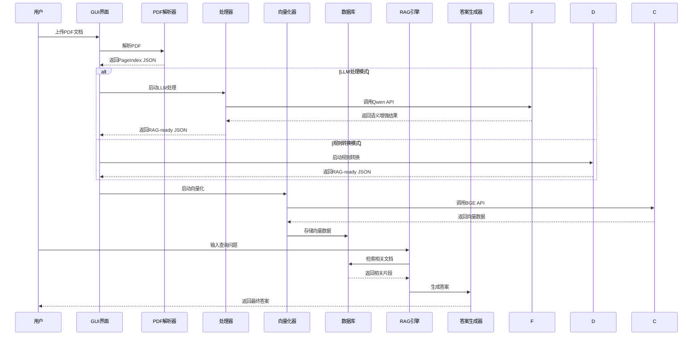
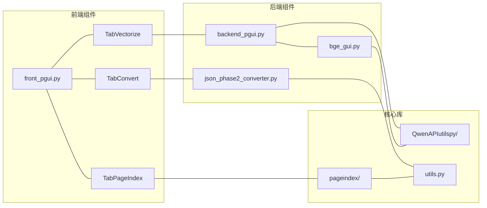
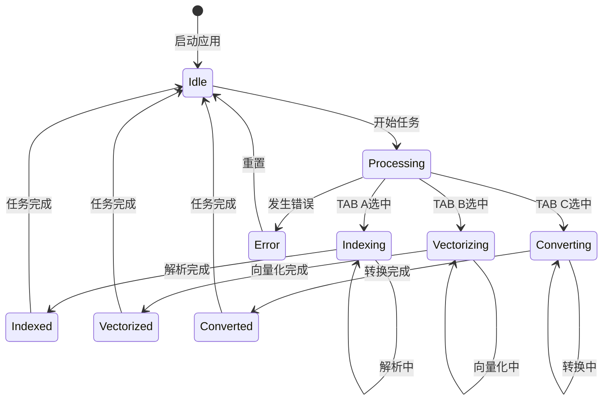
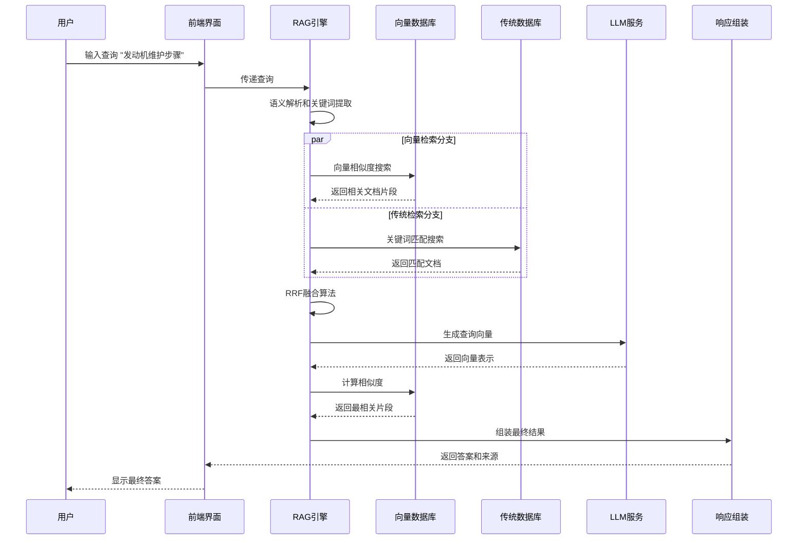
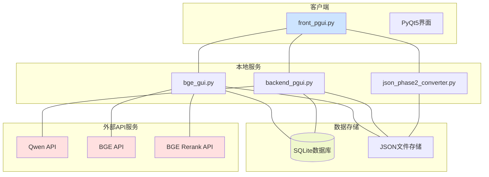

# RAG Code Buddy Mermaid 图表文档

## 系统架构图



## 数据流程图



## 组件依赖图



## 处理管道图

```mermaid
flowchart LR
    Start([PDF文档]) --> A[PageIndex解析]
    A --> B{选择处理管道}
    
    B -->|TAB B: LLM| C[LLM语义增强]
    B -->|TAB C: 规则| D[规则基础转换]
    
    C --> E[向量化处理]
    D --> E
    E --> F[(SQLite数据库)]
    F --> G[RAG检索]
    G --> H[答案生成]
    H --> End([最终答案])

    C -.-> I[API调用<br/>Qwen/BGE])
    D -.-> J[本地规则<br/>无API依赖]
    E -.-> K[BGE向量化<br/>API调用]
    
    style A fill:#e1f5fe
    style C fill:#f3e5f5
    style D fill:#e8f5e8
    style F fill:#fff3e0
    style H fill:#fce4ec
```

## 类结构图

```mermaid
classDiagram
    class MainWindow {
        +str current_tab
        +dict tabs
        +setup_ui()
        +switch_tab()
        +show_visual_window()
    }
    
    class WorkerThread {
        +str input_path
        +str output_path
        +run()
    }
    
    class PageIndexWorker {
        +str pdf_path
        +str model
        +int max_workers
        +run()
    }
    
    class VectorWorker {
        +str json_path
        +str db_path
        +str model
        +run()
    }
    
    class ConverterWorker {
        +str input_path
        +str output_path
        +run()
    }
    
    class BGERetriever {
        +str api_key
        +str base_url
        +vectorize()
        +rerank()
    }
    
    MainWindow ||--o{ WorkerThread : manages
    WorkerThread <|-- PageIndexWorker
    WorkerThread <|-- VectorWorker
    WorkerThread <|-- ConverterWorker
    MainWindow ..> BGERetriever : uses
```

## 状态转换图



## 时序图：RAG查询流程



## 部署架构图



---

**图表版本**: 1.0  
**创建日期**: 2026-01-18  
**作者**: RAG Code Buddy Documentation Team