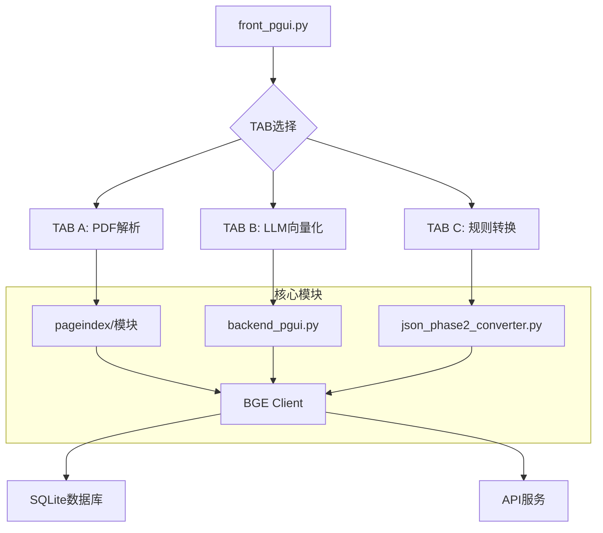

# RAG Code Buddy 技术文档

## 系统概述

RAG Code Buddy DEV0 是一个先进的文档智能处理系统，专为处理复杂文档（如航空公司的波音飞机手册）而设计。系统结合了最新的AI技术、RAG（检索增强生成）和向量化技术，提供了完整的文档解析、处理和检索解决方案。

## 系统架构

### 高层架构

系统采用分层架构，包含以下主要组件：

```
┌─────────────────┐
│   用户界面层     │ ← GUI界面 (PyQt5)
├─────────────────┤
│   业务逻辑层     │ ← 数据处理、API调用
├─────────────────┤
│   数据访问层     │ ← 数据库操作、文件I/O
├─────────────────┤
│   外部服务层     │ ← AI模型API、向量化服务
└─────────────────┘
```

### 组件关系



## 核心模块详解

### 1. Frontend GUI (front_pgui.py)

#### 类结构
- **MainWindow**: 主窗口类
- **WorkerThread**: 后台工作线程

#### 功能
- 三标签页界面管理
- 多线程任务执行
- 进度监控和日志输出
- 可视化窗口集成

#### 关键方法
- `start_pageindex_task()`: 启动PDF解析任务
- `start_vector_task()`: 启动向量化任务
- `start_converter_task()`: 启动规则转换任务

#### 设计模式
- 观察者模式（进度更新）
- 生产者-消费者模式（日志输出）

### 2. Backend Processor (backend_pgui.py)

#### 类结构
- 无显式类，基于函数式编程

#### 核心功能
- 递归树遍历算法
- LLM API调用
- 结构化JSON生成

#### 算法逻辑
```python
def recursive_walk(nodes, path=[], depth=1):
    for node in nodes:
        current_title = node.get("title", "Untitled")
        current_path = path + [current_title]
        yield {"node": node, "path": current_path, "depth": depth}
        
        if "nodes" in node and isinstance(node["nodes"], list):
            yield from recursive_walk(node["nodes"], current_path, depth + 1)
```

#### 关键算法
- 树结构递归遍历
- 语义导语生成
- JSON格式化

### 3. Rule Converter (json_phase2_converter.py)

#### 核心功能
- 树状结构到扁平结构转换
- 无LLM依赖的高速处理
- 与TAB B输出格式兼容

#### 算法逻辑
```python
def convert_tree_to_flat_json(input_path, output_path):
    # 读取输入JSON
    data = json.load(input_path)
    
    # 遍历树结构
    for item in recursive_walk(root_nodes):
        # 生成语义导语
        semantic_intro = generate_semantic_intro(...)
        
        # 创建输出项
        output_item = {
            "embedding_text": semantic_intro + original_content,
            "section_hint": classify_section_type(...),
            "metadata": {...},
            "original_snippet": content
        }
        
        output_data.append(output_item)
```

### 4. BGE Client (bge_gui.py)

#### 类结构
- **VectorWorker**: 向量化工作线程
- **RerankWorker**: 重排序工作线程
- **VectorApp**: 主应用程序类

#### 核心功能
- 向量化处理
- 重排序优化
- SQLite数据库管理

#### 算法实现
- 批处理向量化
- 错误重试机制
- 进度跟踪

## 数据流分析

### 处理管道

```
PDF文档
    ↓
PageIndex JSON (树状结构)
    ↓
├─ TAB B: LLM增强 → RAG-ready JSON
├─ TAB C: 规则转换 → RAG-ready JSON
    ↓
向量化处理
    ↓
SQLite数据库
    ↓
RAG检索引擎
    ↓
答案生成
```

### 数据转换过程

#### 输入格式 (PageIndex JSON)
```json
{
  "doc_name": "document.pdf",
  "structure": [
    {
      "title": "Chapter Title",
      "text": "Content text...",
      "nodes": [...],
      "node_id": "0000"
    }
  ]
}
```

#### 中间格式 (RAG-ready JSON)
```json
{
  "embedding_text": "Semantic intro with content",
  "section_hint": "Section type",
  "metadata": {
    "doc_title": "Title",
    "section_id": "ID",
    "section_path": ["path", "to", "section"],
    "depth": 1,
    "original_length": 100,
    "strategy": 0
  },
  "original_snippet": "Original content"
}
```

#### 输出格式 (向量化)
```json
{
  "id": "unique_id",
  "embedding": [0.1, 0.2, 0.3, ...],
  "dim": 1024,
  "doc_title": "Title",
  "section_id": "ID"
}
```

## 性能优化

### 批处理优化
- **BATCH_SIZE**: 默认8，可根据内存调整
- 批量API调用减少网络开销
- 内存管理优化

### 并发处理
- PyQt多线程支持
- 任务队列管理
- 资源竞争避免

### 缓存策略
- API响应缓存
- 向量结果缓存
- 查询历史缓存

## 安全考虑

### API密钥管理
- 环境变量存储
- 不在代码中硬编码
- 访问权限控制

### 数据隐私
- 本地处理选项
- 数据脱敏机制
- 审计日志记录

### 网络安全
- HTTPS API调用
- SSL证书验证（可选）
- 防止重放攻击

## 错误处理

### 异常类型
- **API错误**: 401（认证失败）、429（频率限制）
- **网络错误**: 连接超时、DNS解析失败
- **数据错误**: JSON格式错误、数据缺失

### 错误恢复
- 重试机制（指数退避）
- 降级处理
- 详细错误日志

### 监控指标
- API调用成功率
- 处理时间统计
- 内存使用情况

## 扩展性设计

### 插件架构
- 模型插件化
- 处理器插件化
- 存储插件化

### 配置驱动
- 配置文件支持
- 动态参数调整
- 环境适应性

### API抽象
- 统一接口设计
- 多供应商支持
- 版本兼容性

## 部署指南

### 本地部署
```bash
# 安装依赖
pip install -r requirements.txt

# 配置环境
cp .env.example .env
# 编辑 .env 文件添加API密钥

# 启动应用
python front_pgui.py
```

### 生产部署
- Docker容器化
- 负载均衡
- 自动扩缩容

## 测试策略

### 单元测试
- 模块功能测试
- 边界条件测试
- 异常处理测试

### 集成测试
- 端到端流程测试
- API集成测试
- 性能基准测试

### 用户验收测试
- 功能验证
- 性能评估
- 用户体验测试

## 维护指南

### 日志管理
- 结构化日志输出
- 日志级别控制
- 日志轮转机制

### 监控告警
- 系统健康检查
- 性能指标监控
- 异常告警通知

### 备份策略
- 配置文件备份
- 数据库备份
- 版本回滚机制

---

**文档版本**: 1.0  
**更新日期**: 2026-01-18  
**作者**: RAG Code Buddy Technical Team